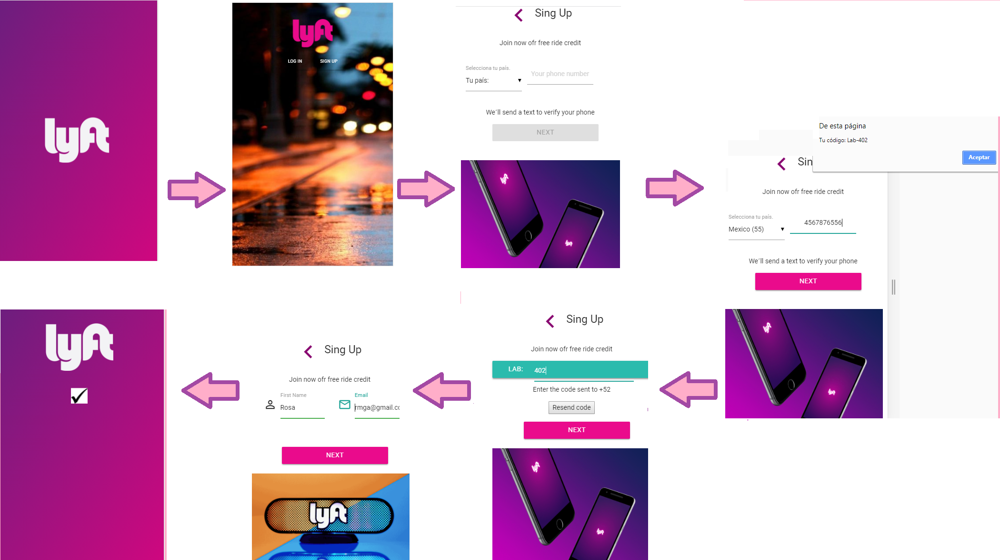

# Lyft
***
## Descripción
Desarrollo de una web-app que replique el sitio de **lyft**, se deben cumplir los pasos necesarios para que un usuario pueda registrarse.

## Estructura de la página en móvil.

## En este proyecto se aplican los siguientes conceptos:
  - Uso de frameworks en CSS.
  - Desarrollo de funciones.
  - Enlace de videos.
  - Uso de jQuery.

## Desarrollado para [Laboratoria](http://www.laboratoria.la/)

## Previo al código

1. Realizar un [**Repositorio en GitHub**](https://github.com/RosyG/lyft-v3)

2. Subir la estructura de carpetas con el comando `git add .`, `git commit -m "comentario"` y `git push origin nombre-rama`

## Flujo de la aplicación:
  - Vista splash con duración de 5 segundos que redirecciona a la vista de inicio. La vista de inicio cuenta con dos botones, en esta ocasión se seguirá el flujo de `SING UP`.
  - En la siguiente vista se tiene un formulario donde el usuario puede escoger el país y debe ingresar su número de teléfono. El botón de NEXT debe estar deshabilitado hasta que se ingrese un número de 10 dígitos.
  - Una vez ingresado el número de teléfono se habilita el botón y al dar click debe enviar una alerta con un código generado aleatoriamente (LAB-000) y redireccionar a la siguiente vista.
  - En esta vista se debe ingresar el código dado anteriormente y una vez hecho esto se habilita el botón que redirecciona al usuario a la vista donde ingresa sus datos. (También se cuenta con la opción de enviar otro código en caso de olvido.)
  - El usuario debe ingresar sus datos por medio de un formulario que pida su nombre, apellido y correo electrónico. Deberá también tener un checkbox para que se acepten los términos y condiciones del servicio.
  - Ya que se ha realizado lo anterior, sólo se deberá mostrar una vista al usuario que le indique que ha concluido con el registro exitosamente.

## Herramientas tecnológicas utilizadas:

* [jQuery](http://jquery.com/download/)
* [materialize](http://materializecss.com/)
* [Falticon](https://www.flaticon.es/categorias/mapas-y-banderas)
